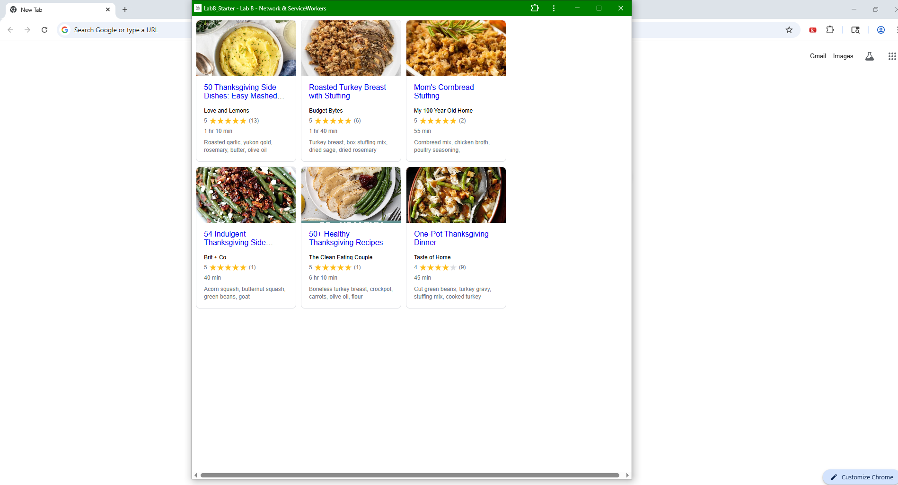

# Lab8-Starter

### BRYAN CANONIZADO

1. Both Graceful degredation and service workers operate when web applications perform offline. Graceful degredation helps web apps operate offline with minimized features while service workers help retain some resources between the network and app.
   
